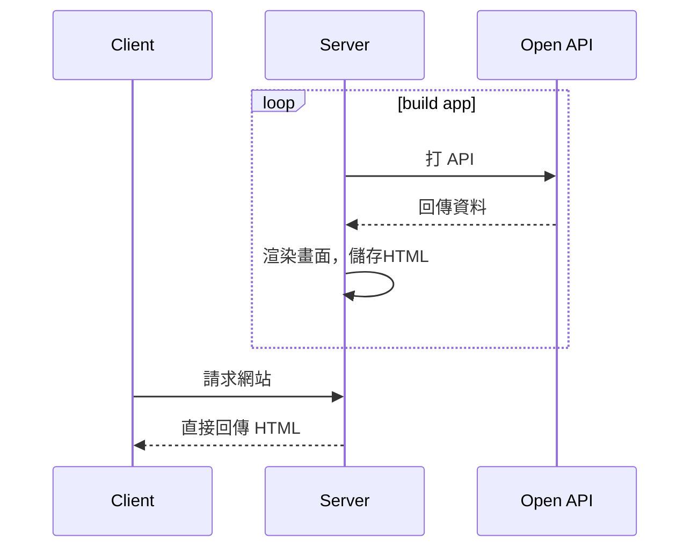
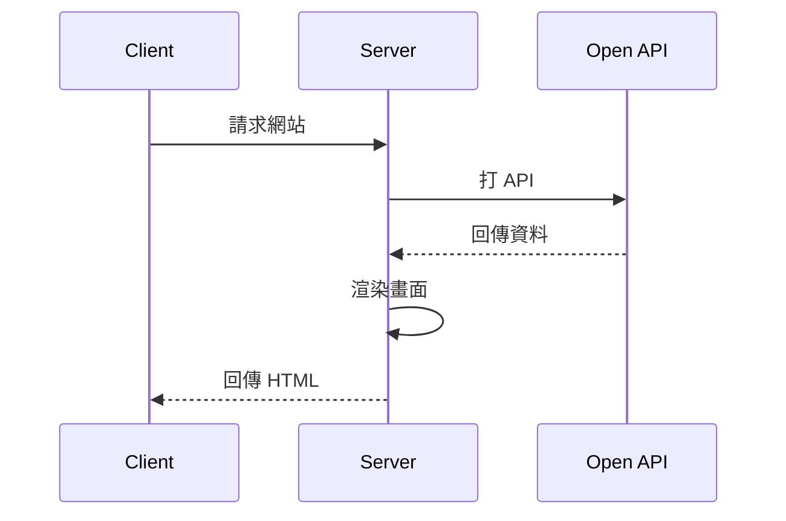
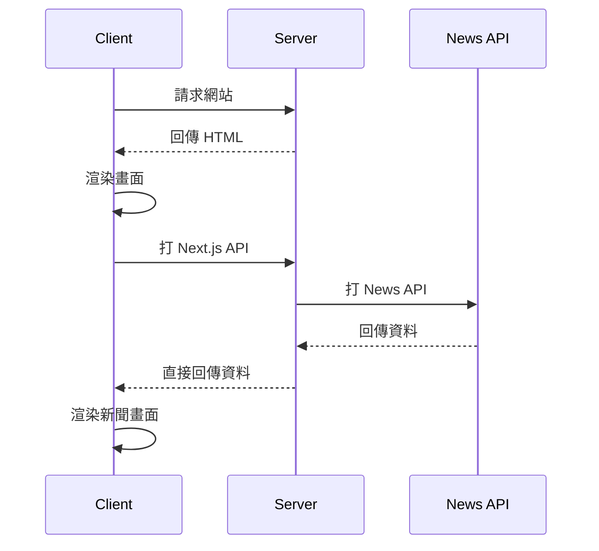

# Taiwan Travel
Demo 連結 []()  
使用 Next.js 建立可滾動顯示的旅遊景點網站  
主要練習內容:
- Next.js
- Chakra UI
- 串接 News API, 台北旅遊網 Open API
- SEO (SSR, SSG)
- 文章顯示優化(滾動載入)
- 圖片效能優化

&nbsp;
## Getting Started
```bash
yarn install && yarn dev
```
&nbsp;
## 架構設計(Travel)
使用 Next.js 提供的後端來串接 News API 獲得資料  
News API 的 API key 存在 Vercel 的環境變數  
前端不直接接觸 News API  
#### 路徑
|頁面|路徑|
|---|---|
|首頁|/|
|新聞|/news|
|旅遊景點|/travel|
|旅遊景點(特定類別)|/travel/:id|
|活動|/travel/activity|

#### SSG 流程圖
- 從網站外直接進入旅遊頁面
- 優化 SEO
- 比較少變化的資料(旅遊景點、分類查詢頁面)

&nbsp;
#### SSR 流程圖
- 從網站外直接進入某個頁面
- 優化 SEO
- 經常變化的頁面(活動頁面、熱門新聞頁面)

&nbsp;
#### CSR 流程圖
- 從網站其他地方進到新聞頁面或活動頁面
- 敏感資料，如用戶個人頁面 
- 已經在某個頁面，要取得更多資料


## 文章渲染優化方式
(尚未實作)  
一開始先 render 一部分資料，監聽頁面滾動，  
滾動到大約離底下 30% 的時候(倒數第二排之類)，再 render 新的資料  

## 圖片渲染優化方式
(尚未實作)

&nbsp;
## Ref.
[React - The Complete Guide](https://www.udemy.com/course/react-the-complete-guide-incl-redux)  
[從零開始學習 Next.js](https://ithelp.ithome.com.tw/users/20110504/ironman/4269)  

##### fake API
[台北旅遊網 Open API](https://www.travel.taipei/open-api)  
[Taiwan News API](https://newsapi.org/s/taiwan-news-api)  
Top headlines 才能設定國家，Everything 這個 sources 的參數打不到東西，domains 設定 hostname 要自己確認，像是 yahoo.com 才能抓到, tw.news.yahoo.com 就不能 ，而且抓下來的 detail 內容會有 html 標籤，但這是後端的問題，只能先無視了  
<棄用> 一天限制 100 條太少，只用 Top headlines 的功能就好  

[JSONPlaceHolder](https://jsonplaceholder.typicode.com/)  
[Fake Store API](https://fakestoreapi.com/)  

##### Next.js external url Image come from multiple domain
用 Next.js 的 API 代理  
https://stackoverflow.com/questions/70576887/how-to-use-next-js-and-multiple-images-domain-urls  
或用 imgix 代理  
https://stackoverflow.com/questions/71235874/how-to-allow-all-domains-for-image-nextjs-config  

##### Next router, Next Link, anchor tag 對 SEO 影響的差別
[Stack Overflow 連結](https://stackoverflow.com/questions/65086108/next-js-link-vs-router-push-vs-a-tag)  
Chakra UI Button 當站內連結的時候用 as={Link} 即可，不要寫 router.push，如新聞 detail 頁按鈕

##### 其他問題
[把被編碼後的HTML tag字串轉回HTML](https://www.dotblogs.com.tw/HaoAreYou/2021/08/19/103005)  
[用 HTML br 替換 ↵ 換行前先想一想](https://simonallen.coderbridge.io/2020/07/03/replace-br/)  
[Pass fetched data from getStaticPaths to getStaticProps](https://github.com/vercel/next.js/discussions/11272)  

##### Markdown 流程圖
[Mermaid 官方文件](https://mermaid.js.org/#/)  
[Draw Diagrams With Markdown](https://support.typora.io/Draw-Diagrams-With-Markdown/#sequence-diagrams-1)